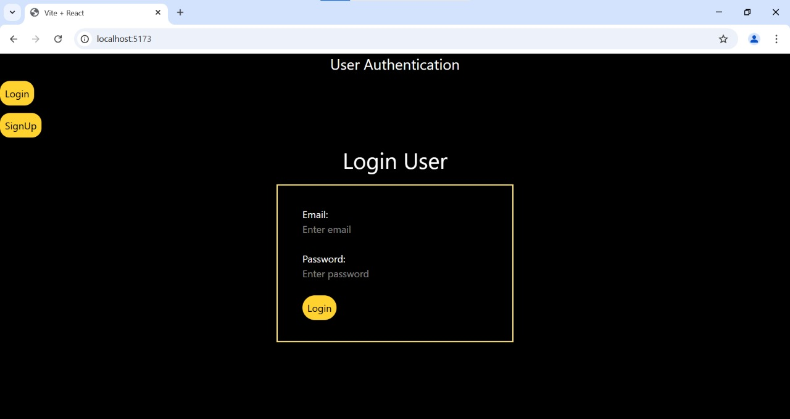
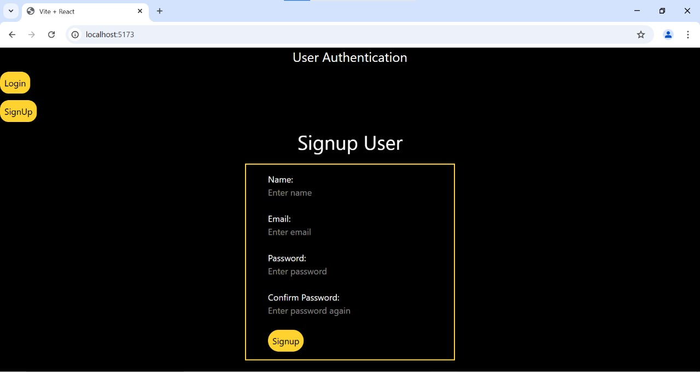

# 🔑 User Authentication System  

A **React.js frontend** with an **Express.js backend** for user authentication using MongoDB.  

---

## 🚀 Features  
- User **Signup & Login**  
- MongoDB Database  
- API Endpoints for Authentication (`/api/signup`, `/api/login`)  
- Styled with Tailwind CSS  

---

## 📦 Installation  

### **Clone the Repository**  
```bash
git clone https://github.com/pankajkumar23/User-Authentication.git
cd user Authentication
```

### **Install Dependencies**  
#### **Backend (Express.js)**
```bash
cd backend
npm install
```
#### **Frontend (React.js)**
```bash
cd frontend
npm install
```

### **Set Up Environment Variables**  
Create a **`.env`** file in the `backend` directory:  
```env
MONGO_URI=your_mongodb_connection_string
```

---

## 🚀 Running the Application  

### **Start Backend Server**  
```bash
cd backend
npm start
```
> Runs on **`http://localhost:3000`**

### **Start Frontend**  
```bash
cd frontend
npm run dev
```
> Runs on **`http://localhost:5173`**  

---

## 🔗 API Endpoints  

### **Signup**  
`POST /api/signup`  
```json
{
  "name": "John Doe",
  "email": "john@example.com",
  "password": "securepassword"
}
```

### **Login**  
`POST /api/login`  
```json
{
  "email": "john@example.com",
  "password": "securepassword"
}
```

---

## 📜 License  
This project is licensed under the **MIT License**.  

---

## Screenshots

### Login Page


### Signup Page



  

